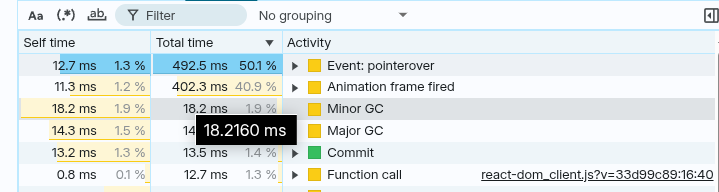
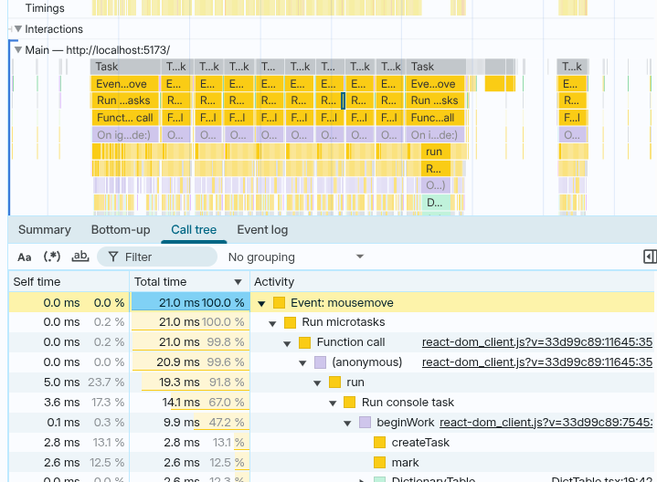
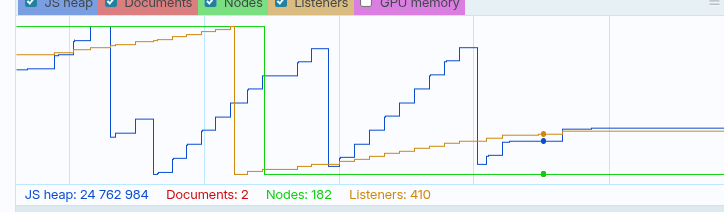
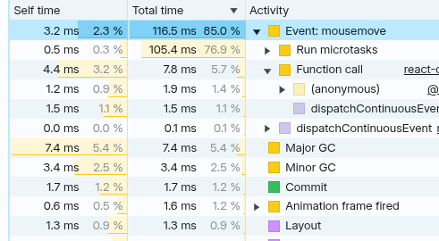

# Тестовое задание — Frontend Developer (React, TypeScript, React Flow)

## Описание

В рамках этого тестового задания вам предоставлен проект, позволяющий строить граф из нод.
Каждая нода инициализируется случайным словарём значений. При соединении двух нод данные из исходной ноды добавляются в целевую.
На экране также отображается текущий FPS (кадры в секунду).

## Основная задача

При количестве нод 3+ во время перетаскивания ноды по рабочей области наблюдается сильное проседание FPS.
Ваша задача — выявить источник проблемы и устранить её.

> После выполнения укажите краткое описание найденной причины и каким способом вы ее устранили.

## Дополнительная задача

Реализовать **сохранение состояния графа** при перезагрузке/закрытии страницы.
Данные графа (нод, связей, словарей) должны восстанавливаться автоматически при открытии страницы.

## Будет плюсом

* Деплой готового решения (например, с помощью [GitHub Pages](https://pages.github.com/)).
* Краткий и понятный код.
* Использование современных подходов React/TypeScript.

## Стек проекта

* Vite
* TypeScript
* React
* React Flow

Удачи!

## Решение
Первое, что сделал - попробовал воспроизвести проблему. При создании определённого количества нод и их перетягивании FPS действительно падает. В моём случае на 30-40%, до 40-45 FPS.

Идём в perfomance profiler, делаем снимок

Общая картина обманчива. На странице есть компонент счётчика FPS, который срабатывает каждый frame и раз в секунду делает апдейт.
Сужаем область до, собственно, перетягивания элемента

Тут уже видно, что mousemove отрабатывыает часто и относительно долго. При этом, если раскрыть дерево, видно что постоянно перерисовываются компоненты App, Node и DictTable

Дальше проводим небольшой ресёрч и мемоизируем компонент ноды, который рендерится на каждое изменение свойств.

Отдельно подмечаем лавинообразный рост количества listener'ов и JS Heap. За относительно небольшой период количество listener'ов вырастает на десятки и даже сотни.

Ищем, где они могут создаваться. Обнаруживаем в App кучку callback'ов, которые пересоздаются на каждое изменение nodes.

Перетаскиваем их все в store и делаем мемоизацию биндинга получившихся action'ов (чтоб уж с гарантией). 

Заодно вспоминаем про хэлпер bindActionCreators, который позволяет сократить количество кода на привязке action creator'ов и не мешает типизации

После делаем ещё один замер в profiler

Похоже удалось немного сократить время обработки mousemove (с 20ms до ~3ms). Фреймрейт при этом стабилен. Что от нас и требовалось.
